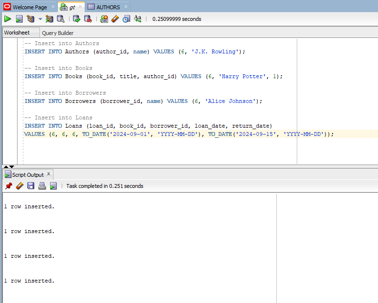
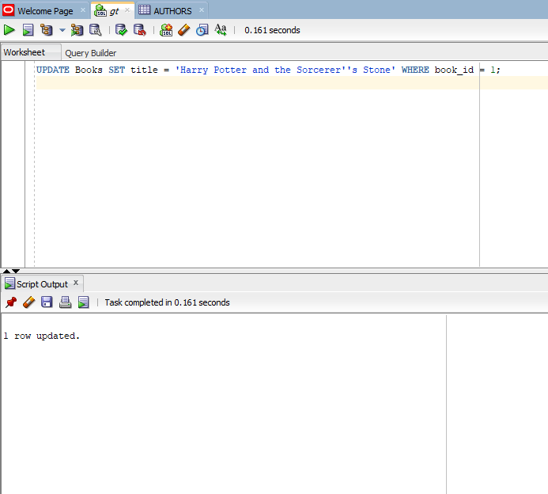
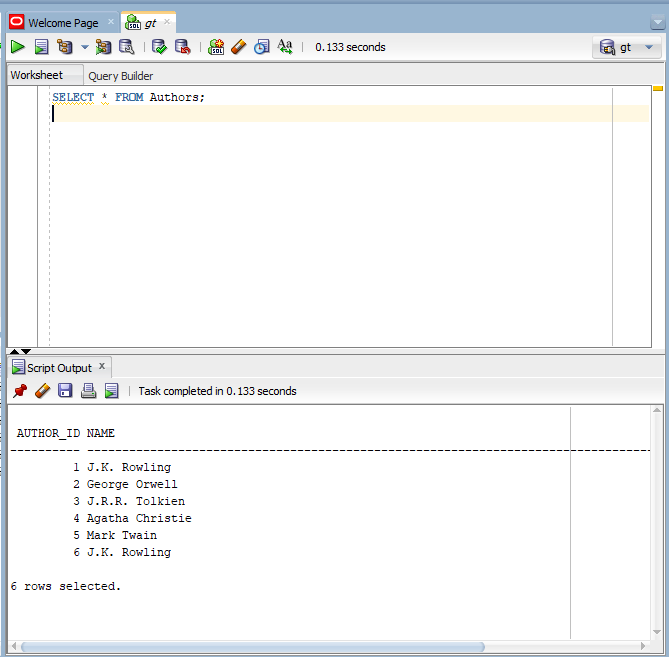

<<<<<<< HEAD
# oracle-sql-tests
keep working
=======
------------------------------------Library Management System Database---------------------------------------

   Problem Statement

The Library Management System (LMS) is designed to streamline the management of books, authors, borrowers, and loans within a library. The primary goal of this system is to facilitate the efficient tracking of books and their availability, manage borrower records, and keep a history of loans and returns. This database will enable library staff to easily access information, perform operations on the records, and generate reports as needed.

--------Database Structure---------

 -----The database consists of four main tables:

Authors: Stores information about authors, including a unique author ID and their names.
Books: Contains details about books, including a unique book ID, title, and a reference to the author.
Borrowers: Holds records of individuals who can borrow books from the library.
Loans: Records the loans of books to borrowers, including loan dates and return dates.

        ----Conceptual Diagram---

   [image-1](https://github.com/user-attachments/assets/caf4ceea-fb42-473d-bcaa-58d908a769d8)

          SQL Commands Executed
--------1. DDL Commands-------
Creating Tables:
 The following commands were used to create the database tables.

CREATE TABLE Authors (
    author_id INT PRIMARY KEY,
    name VARCHAR(100)
);

CREATE TABLE Books (
    book_id INT PRIMARY KEY,
    title VARCHAR(100),
    author_id INT,
    FOREIGN KEY (author_id) REFERENCES Authors(author_id)
);

CREATE TABLE Borrowers (
    borrower_id INT PRIMARY KEY,
    name VARCHAR(100)
);

CREATE TABLE Loans (
    loan_id INT PRIMARY KEY,
    book_id INT,
    borrower_id INT,
    loan_date DATE,
    return_date DATE,
    FOREIGN KEY (book_id) REFERENCES Books(book_id),
    FOREIGN KEY (borrower_id) REFERENCES Borrowers(borrower_id)
);
-------2. DML Commands-----
Inserting Data: 
The following commands were used to insert initial records into the tables.

      1. Insert Values into Authors Table

INSERT INTO Authors (author_id, name) VALUES (1, 'J.K. Rowling');
INSERT INTO Authors (author_id, name) VALUES (2, 'George Orwell');
INSERT INTO Authors (author_id, name) VALUES (3, 'J.R.R. Tolkien');
INSERT INTO Authors (author_id, name) VALUES (4, 'Agatha Christie');
INSERT INTO Authors (author_id, name) VALUES (5, 'Mark Twain');

      2. Insert Values into Books Table

INSERT INTO Books (book_id, title, author_id) VALUES (1, 'Harry Potter', 1);
INSERT INTO Books (book_id, title, author_id) VALUES (2, '1984', 2);
INSERT INTO Books (book_id, title, author_id) VALUES (3, 'The Hobbit', 3);
INSERT INTO Books (book_id, title, author_id) VALUES (4, 'Murder on the Orient Express', 4);
INSERT INTO Books (book_id, title, author_id) VALUES (5, 'The Adventures of Tom Sawyer', 5);

      3. Insert Values into Borrowers Table
  
INSERT INTO Borrowers (borrower_id, name) VALUES (1, 'Alice Johnson');
INSERT INTO Borrowers (borrower_id, name) VALUES (2, 'Bob Smith');
INSERT INTO Borrowers (borrower_id, name) VALUES (3, 'Charlie Brown');
INSERT INTO Borrowers (borrower_id, name) VALUES (4, 'Diana Prince');
INSERT INTO Borrowers (borrower_id, name) VALUES (5, 'Evan Wright');

    4. Insert Values into Loans Table

INSERT INTO Loans (loan_id, book_id, borrower_id, loan_date, return_date) 
VALUES (1, 1, 1, TO_DATE('2024-09-01', 'YYYY-MM-DD'), TO_DATE('2024-09-15', 'YYYY-MM-DD'));
INSERT INTO Loans (loan_id, book_id, borrower_id, loan_date, return_date) 
VALUES (2, 2, 2, TO_DATE('2024-09-02', 'YYYY-MM-DD'), TO_DATE('2024-09-16', 'YYYY-MM-DD'));
INSERT INTO Loans (loan_id, book_id, borrower_id, loan_date, return_date) 
VALUES (3, 3, 3, TO_DATE('2024-09-03', 'YYYY-MM-DD'), TO_DATE('2024-09-17', 'YYYY-MM-DD'));
INSERT INTO Loans (loan_id, book_id, borrower_id, loan_date, return_date) 
VALUES (4, 4, 4, TO_DATE('2024-09-04', 'YYYY-MM-DD'), TO_DATE('2024-09-18', 'YYYY-MM-DD'));
INSERT INTO Loans (loan_id, book_id, borrower_id, loan_date, return_date) 
VALUES (5, 5, 5, TO_DATE('2024-09-05', 'YYYY-MM-DD'), TO_DATE('2024-09-19', 'YYYY-MM-DD'));

Updating Data: 
An example of updating a record in the Books table.
UPDATE Books SET title = 'Harry Potter and the Sorcerer''s Stone' WHERE book_id = 1;

Deleting Data: 
An example of deleting a record from the Loans table.
DELETE FROM Loans WHERE loan_id = 1;

------3. DCL Command-------
Granting Privileges: 
Example command to grant SELECT and INSERT privileges.
GRANT SELECT, INSERT ON Authors TO DIP;

4. TCL Commands
Committing Transactions: Example command to commit changes.
COMMIT;

*******Screenshots****

SQL Queries and Results
Insert Query:

Update Query:

Select Query:

Explanation of Results

Inserting Data: Upon executing the insert commands, records were successfully added to the respective tables, confirming that the database is properly set up to accept new entries.

Updating Data: The update command reflected changes in the Books table, demonstrating that the DML operations are functional and can modify existing data.

Deleting Data: Deleting a loan record confirmed the database's capability to remove unwanted entries.

Granting Privileges: Granting permissions to other users will allow for collaborative usage of the database, ensuring that the right users have access to necessary operations.

Conclusion
The Library Management System database is now fully functional, supporting essential operations for managing books, authors, borrowers, and loans. Further enhancements can include implementing advanced queries and developing a user interface for easier interaction with the database.

